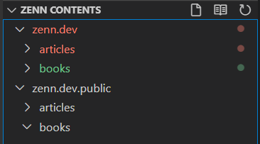
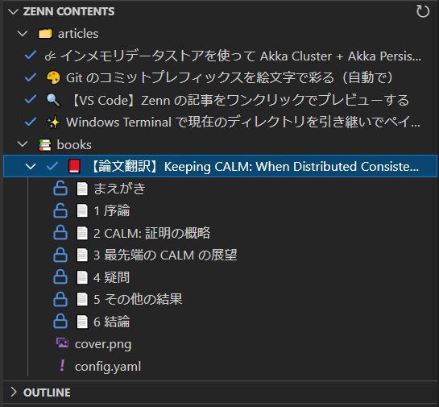

# Change Log

vscode-zenn-editor の注目すべき変更はこのファイルで文書化されます。

このファイルの書き方に関する推奨事項については、[Keep a Changelog](http://keepachangelog.com/) を確認してください。

## [リリース予定]
[リリース予定]: https://github.com/negokaz/vscode-zenn-editor/compare/v0.7.2...HEAD

## [0.7.2] - 2021-05-09
[0.7.2]: https://github.com/negokaz/vscode-zenn-editor/compare/v0.7.1...v0.7.2

### Fixed

- VSCode Insiders でプレビューが表示されない問題 [#23](https://github.com/negokaz/vscode-zenn-editor/issues/23) を修正 [PR#24](https://github.com/negokaz/vscode-zenn-editor/pull/24)

## [0.7.1] - 2021-05-03
[0.7.1]: https://github.com/negokaz/vscode-zenn-editor/compare/v0.7.0...v0.7.1

### Fixed

- タイトルを変更したときにコンテンツ一覧での並び順が変わってしまうことがある問題を修正しました [PR#20](https://github.com/negokaz/vscode-zenn-editor/pull/20)
- 投稿コンテンツの一覧で VSCode のフィルター機能が使えない問題を修正しました [PR#21](https://github.com/negokaz/vscode-zenn-editor/pull/21)

    フィルター機能については、次のページを参照してください

    > Improved keyboard navigation
    >
    > [Visual Studio Code January 2019](https://code.visualstudio.com/updates/v1_31#_new-tree-widget)

## [0.7.0] - 2021-04-29
[0.7.0]: https://github.com/negokaz/vscode-zenn-editor/compare/v0.6.0...v0.7.0

### Changed

- ロゴを変更しました [PR#17](https://github.com/negokaz/vscode-zenn-editor/pull/17)
- 投稿コンテンツのタイトルなどの変更がリアルタイムで Explorer に反映されるようになりました [PR#18](https://github.com/negokaz/vscode-zenn-editor/pull/18)

## [0.6.0] - 2021-04-28
[0.6.0]: https://github.com/negokaz/vscode-zenn-editor/compare/v0.5.1...v0.6.0

### Added

- ワークスペースをサポートしました [PR#13](https://github.com/negokaz/vscode-zenn-editor/pull/13)

    Zenn に複数のリポジトリを連携した場合、それぞれのローカルリポジトリのフォルダをワークスペースとしてまとめることで両方の投稿コンテンツを一覧したり、プレビューしたりできます。

    **関連する Zenn の変更**
    > GitHubリポジトリを2つまで連携することがが可能に
    >
    > [Zenn Changelog ✨](https://zenn.dev/changelog#20210401)

    Explorer 上で全てのワークスペースフォルダが一覧できます。

    

## [0.5.1] - 2021-04-26
[0.5.1]: https://github.com/negokaz/vscode-zenn-editor/compare/v0.5.0...v0.5.1

自動リリース動作確認用バージョンで、拡張本体の変更点はありません

## [0.5.0] - 2021-04-19
[0.5.0]: https://github.com/negokaz/vscode-zenn-editor/compare/v0.4.0...v0.5.0

### Added

- article と book を VSCode 上で作成できるようになりました [PR#9](https://github.com/negokaz/vscode-zenn-editor/pull/9)

    `ZENN CONTENTS` ビューに表示されるアイコンをクリックするか、コマンドパレットで次のコマンドを実行します

    - Zenn Editor: Create New Article
    - Zenn Editor: Create New Book

## [0.4.0] - 2021-02-28
[0.4.0]: https://github.com/negokaz/vscode-zenn-editor/compare/v0.3.0...v0.4.0

### Added

- article と book の一覧を Explorer で確認できるようになりました [PR#7](https://github.com/negokaz/vscode-zenn-editor/pull/7)

    一覧はファイル名ではなくコンテンツのタイトルで表示されます。  
    また、公開/非公開の状態や本のセクションの有料/無料をアイコンで確認できます

    

## [0.3.0] - 2021-02-28
[0.3.0]: https://github.com/negokaz/vscode-zenn-editor/compare/v0.2.0...v0.3.0

### Added

- ステータスバーに画像アップロードページへのリンクが表示されるようになりました [PR#5](https://github.com/negokaz/vscode-zenn-editor/pull/5)

    

    Zenn Editor のプレビューが開いている時にだけ表示されます

## [0.2.0] - 2021-02-27

[0.2.0]: https://github.com/negokaz/vscode-zenn-editor/compare/v0.1.0...v0.2.0

### Added

- `./node_modules/.bin` の zenn コマンドを環境変数 `PATH` の設定なしで認識する [PR#2](https://github.com/negokaz/vscode-zenn-editor/pull/2)

### Fixed

- リンクカードをクリックしてもページを開けない問題を修正 [PR#3](https://github.com/negokaz/vscode-zenn-editor/pull/3)

## [0.1.0] - 2021-02-23

[0.1.0]: https://github.com/negokaz/vscode-zenn-editor/compare/v0.0.0...v0.1.0

- 初回リリース🚀
