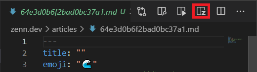
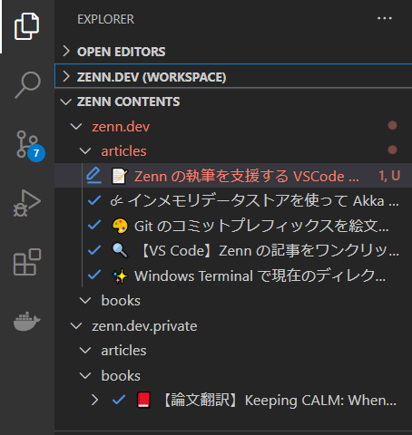
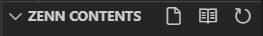
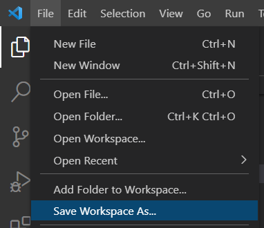

# VS Code Zenn Editor

 

[Zenn CLI](https://zenn.dev/zenn/articles/install-zenn-cli) を VS Code に統合する非公式の拡張です。

## Features

- 編集中の投稿コンテンツをプレビューできます
- 投稿コンテンツを一覧表示できます
- 投稿コンテンツを作成できます
- 画像アップロードページに素早くアクセスできます

## Requirements

- Zenn CLI がインストールされている必要があります。インストール方法は [こちら](https://zenn.dev/zenn/articles/install-zenn-cli)

## Demo

## Known Issues

- 記事に埋め込まれた YouTube の動画は VS Code の制約によりプレビュー上で再生できません：
    - [Can not play video in webview · Issue · microsoft/vscode](https://github.com/microsoft/vscode/issues/54097)

## Usages

### 投稿コンテンツのプレビュー

投稿コンテンツの編集中に、次のプレビューボタンをクリックします。

### 編集する投稿コンテンツをタイトルで選択する

Explorer にある「ZENN CONTENTS」ビューで投稿コンテンツの一覧を確認できます。

コンテンツをクリックするとテキストエディタが開きます。

### Article の作成

Zenn Contents ビュー上の紙のアイコンをクリックするか、コマンドパレットから `Zenn Editor: Create New Article` を実行します。

### Book の作成

Zenn Contents ビュー上の本のアイコンをクリックするか、コマンドパレットから `Zenn Editor: Create New Book` を実行します。

### 画像アップロードページを開く

プレビュー中に表示される次のボタンをクリックすると、Zenn の画像アップロードページが外部ブラウザで開きます。

### 複数のリポジトリをひとつのウィンドウで編集する

Zenn には 2 つまで連携するリポジトリを設定できます。

複数のリポジトリをひとつのウィンドウで編集するには、VSCode のワークスペースを構成します。

`Add Folder to Workspace` でもうひとつのローカルリポジトリを指定し、`Save Workspace As` でワークスペースを保存します。保存されたワークスペースを開くと複数のリポジトリの同時編集をいつでも再開できます。

## Changelog

[CHANGELOG.md](CHANGELOG.md) を参照してください。

## License

Copyright (c) 2021 Kazuki Negoro

vscode-zenn-editor is released under the [MIT License](LICENSE)
