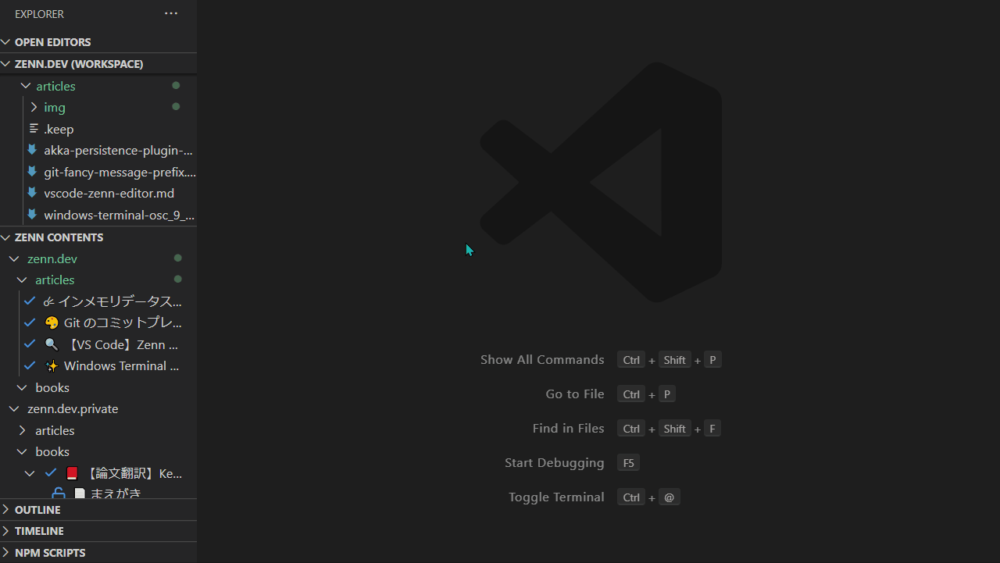

# VS Code Zenn Editor

[Zenn CLI](https://zenn.dev/zenn/articles/install-zenn-cli) を VS Code に統合する非公式の拡張です。

## Features

- 編集中の `articles` か `books` を VS Code 上でプレビューできます

## Requirements

- Zenn CLI がインストールされている必要があります。インストール方法は [こちら](https://zenn.dev/zenn/articles/install-zenn-cli)

## Demo

## Known Issues

- 記事に埋め込まれた YouTube の動画は VS Code の制約によりプレビュー上で再生できません：
    - [Can not play video in webview · Issue #54097 · microsoft/vscode](https://github.com/microsoft/vscode/issues/54097)

## Changelog

[CHANGELOG.md](CHANGELOG.md) を参照してください。

## License

Copyright (c) 2021 Kazuki Negoro

vscode-zenn-editor is released under the [MIT License](LICENSE)
